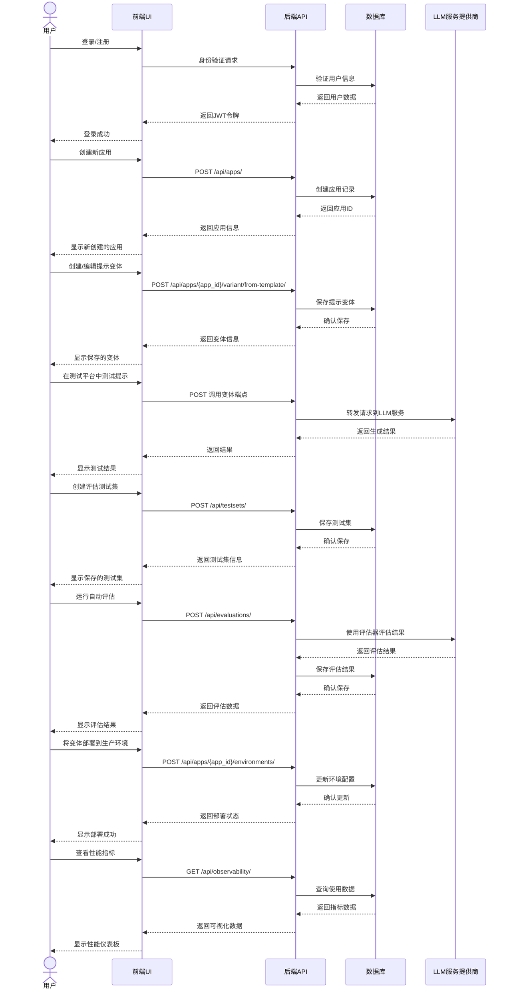
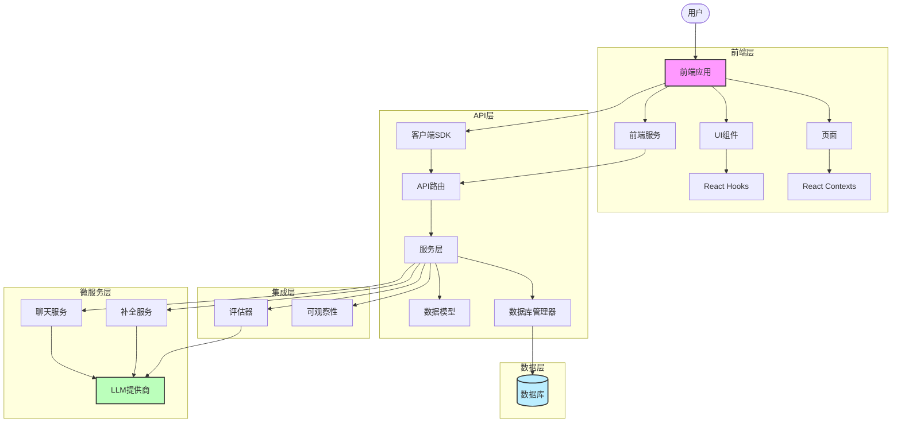

<p align="center">
  <a href="https://agenta.ai?utm_source=github&utm_medium=referral&utm_campaign=readme">
      <picture >
        <source width="275" media="(prefers-color-scheme: dark)" srcset="https://github.com/Agenta-AI/agenta/assets/4510758/cdddf5ad-2352-4920-b1d9-ae7f8d9d7735"  >
        <source width="275" media="(prefers-color-scheme: light)" srcset="https://github.com/Agenta-AI/agenta/assets/4510758/ab75cbac-b807-496f-aab3-57463a33f726"  >
        
      </picture>
  </a>
<div align="center">
  <strong> <h1> 开源LLMOps平台 </h1></strong>
  通过集成的提示管理、评估和可观察性，更快地构建可靠的LLM应用程序。
</div>
</p>

---

<h3 align="center">
  <a href="https://docs.agenta.ai?utm_source=github&utm_medium=referral&utm_campaign=readme"><b>文档</b></a> &bull;
  <a href="https://agenta.ai?utm_source=github&utm_medium=referral&utm_campaign=readme"><b>网站</b></a> &bull;
  <a href="https://cloud.agenta.ai?utm_source=github&utm_medium=referral&utm_campaign=readme"><b>Agenta云服务</b></a>
</h3>

---

## Agenta是什么？

Agenta是一个用于构建生产级LLM应用程序的平台。它通过集成的提示管理、评估和可观察性，帮助**工程**和**产品团队**更快地创建可靠的LLM应用。

## 核心功能

### 🧪 提示工程与管理
与领域专家(SME)合作进行提示工程，确保生产环境中没有任何问题。

- **交互式测试平台**：针对测试用例并排比较提示
- **多模型支持**：使用50多个LLM模型进行实验或[引入自己的模型](https://docs.agenta.ai/prompt-management/adding-custom-providers?utm_source=github&utm_medium=referral&utm_campaign=readme)
- **版本控制**：通过分支和环境对提示和配置进行版本控制
- **复杂配置**：使SME能够在简单提示之外协作处理[复杂配置模式](https://docs.agenta.ai/custom-workflows/overview?utm_source=github&utm_medium=referral&utm_campaign=readme)

### 📊 评估与测试
通过人工和自动反馈系统地评估您的LLM应用程序。
- **灵活的测试集**：从生产数据、测试平台实验或上传的CSV创建测试用例
- **预构建和自定义评估器**：使用LLM作为评判、20多个预构建评估器之一，或您的自定义评估器
- **UI和API访问**：通过UI（适用于SME）或以编程方式（适用于工程师）运行评估
- **人工反馈集成**：收集并整合专家注释

### 📡 可观察性与监控
了解您在生产中的LLM应用程序情况。
- **成本和性能跟踪**：监控支出、延迟和使用模式
- **追踪**：使用详细跟踪调试复杂工作流程
- **开放标准**：与OpenLLMetry和OpenInference兼容的原生OpenTelemetry跟踪
- **集成**：预构建了与大多数模型和框架的集成

## 系统功能流程图

下面的时序图展示了Agenta平台中的主要用户交互路径和数据流向：



## 用户交互路径

1. **账户管理**
   - 用户注册和登录
   - 组织和工作区管理
   - 权限和角色分配

2. **应用程序管理**
   - 创建新应用程序
   - 基于模板设置应用程序
   - 配置应用程序设置

3. **提示工程流程**
   - 创建和编辑提示变体
   - 版本控制和分支管理
   - 对比不同提示变体性能

4. **测试流程**
   - 使用交互式测试平台
   - 创建测试用例
   - 加载和保存测试情境

5. **评估过程**
   - 设置评估指标和标准
   - 执行人工和自动评估
   - 分析评估结果

6. **部署流程**
   - 将提示变体部署到不同环境
   - 配置生产环境
   - 管理环境特定设置

7. **监控与可观察性**
   - 查看使用指标
   - 监控成本和性能
   - 分析生产中的模型行为

## 数据流向

1. **前端到后端**
   - UI请求通过RESTful API发送到后端
   - 身份验证通过JWT令牌管理
   - 文件和大型数据通过表单数据传输

2. **后端处理**
   - API服务验证请求并处理业务逻辑
   - 数据通过ORM层与数据库交互
   - 后台任务通过异步队列处理

3. **LLM集成**
   - 后端服务与LLM提供商API集成
   - 请求和响应通过标准化接口传输
   - 结果缓存以优化性能

4. **数据存储**
   - 提示和配置存储在数据库中
   - 版本历史记录审计跟踪变更
   - 评估结果和指标存储以供分析

5. **可观察性数据流**
   - 使用和性能指标通过专用API收集
   - 指标数据聚合并可视化
   - 可选择将数据导出到外部监控系统

## 快速开始

请参考主README.md中的完整安装和入门指南。 

## 代码组织与架构

Agenta平台采用了模块化的代码组织方式，以微服务架构为基础，将功能划分为独立的组件。下面是对代码组织结构、核心模块和组件通信方式的概述。

### 代码组织结构

```
agenta/
├── api/                  # 后端API服务
│   └── oss/src/          # 开源版API源代码
│       ├── apis/         # API端点实现
│       ├── core/         # 核心功能
│       ├── dbs/          # 数据库连接和操作
│       ├── models/       # 数据模型
│       ├── resources/    # 资源定义
│       ├── routers/      # API路由
│       ├── services/     # 服务层实现
│       └── utils/        # 工具函数
│
├── sdk/                  # 客户端SDK
│   └── agenta/           # SDK源代码
│       ├── client/       # 客户端实现
│       └── sdk/          # SDK核心功能
│
├── services/             # 微服务
│   ├── chat/             # 聊天服务
│   └── completion/       # 文本补全服务
│
├── web/                  # 前端应用
│   └── oss/src/          # 开源版前端源代码
│       ├── components/   # UI组件
│       ├── contexts/     # React上下文
│       ├── hooks/        # React钩子
│       ├── lib/          # 工具库
│       ├── pages/        # 页面组件
│       └── services/     # 前端服务
│
└── hosting/              # 部署配置
    └── docker-compose/   # Docker Compose配置
```

### 核心模块

Agenta平台由以下核心模块组成：

1. **后端API服务(api)**
   - **routers**: 定义API路由和端点
   - **services**: 实现业务逻辑和服务功能
   - **models**: 定义数据模型和结构
   - **dbs**: 管理数据库连接和操作

2. **客户端SDK(sdk)**
   - 提供与Agenta平台交互的编程接口
   - 简化应用开发和集成过程

3. **微服务(services)**
   - **chat**: 提供聊天服务功能
   - **completion**: 提供文本补全服务

4. **前端应用(web)**
   - **pages**: 定义应用页面和路由
   - **components**: 可复用UI组件
   - **services**: 前端服务和API调用
   - **contexts**: 状态管理和上下文

5. **部署配置(hosting)**
   - 提供不同环境的部署配置
   - 支持Docker容器化部署

### 组件关系图

下面是Agenta平台的组件关系图，展示了各组件之间的交互和数据流动：



### 组件通信方式

1. **前端到后端通信**
   - 前端通过RESTful API与后端服务通信
   - 使用Axios库处理HTTP请求
   - JWT令牌用于身份验证和授权

2. **后端服务间通信**
   - 服务间通过API调用进行通信
   - 使用数据库作为持久化存储和数据共享
   - 某些场景下使用异步任务队列(Celery)

3. **SDK集成**
   - SDK提供编程接口，简化与Agenta API的交互
   - 支持Python等语言，方便开发者集成

4. **LLM服务提供商集成**
   - 通过标准化接口连接到各种LLM服务提供商
   - 支持自定义提供商和模型

5. **数据流动**
   - 用户通过前端界面提交请求
   - 请求经API路由转发到相应的服务
   - 服务处理请求并与数据库或LLM提供商交互
   - 结果返回给前端并显示给用户

通过这种模块化的架构设计，Agenta平台实现了高度的可扩展性和灵活性，使得开发者可以轻松地添加新功能、集成新的LLM模型，并根据需求定制平台。 